# MİMARİ — Üs Savunma Karar Destek Sistemi

> **Tek cümlede:** Drone tespitlerini, araç hareket kayıtlarını ve serbest metin saha raporlarını birleştiren; zorunlu kanıtı **deterministik** bir hatla üreten, yalnızca **belirsizlikte** karar veren bir **LLM agent** ile risk değerlendirmesi yapan ve sonucu **denetlenebilir** biçimde operatöre sunan hibrit bir karar destek sistemi.

İlgili belgeler: [CASE.md](CASE.md) (veri analizi) · [FINDINGS.md](FINDINGS.md) (kararlar, önce/sonra) · [STRUCTURE.md](STRUCTURE.md) (dosya yapısı, API) · [EVAL.md](EVAL.md) (insan değerlendirmesi)

---

## 0. Beş cümlelik özet (sunumun iskeleti)

1. **Problem:** 40 drone görüntüsü, 226 araç hareket kaydı ve 137 saha raporu var. Raporların bir kısmı yanlış ve özellikle "dost/ikmal" iddiaları tuzak. Görev, her görüntüde neyin tehlikeli olduğunu **gerekçesi ve dayandığı veriyle** söylemek.
2. **Mimari karar:** **Hibrit iki katman.** Katman 1, LLM kullanmadan her görüntü için eksiksiz bir *kanıt dosyası* üretir (tespit ↔ track füzyonu, kinematik, rapor doğrulama, kural tabanlı risk). Katman 2'de bir LLM agent bu dosyayı okur, **yalnızca belirsiz noktalarda** tool'larla soruşturma yapar ve son kararı gerekçesiyle verir.
3. **Neden böyle:** Zorunlu kanıtın LLM'in insiyatifine kalması, sessiz kaçırmalara yol açar. Deterministik iş LLM'e yaptırıldığında hem pahalı hem tekrarlanamaz olur. LLM'in gerçek değeri belirsizliği çözmek ve gerekçe yazmaktır.
4. **Güvence:** Kanıt hiyerarşisi (tespit > hareket > rapor), şema doğrulayıcısı, iterasyon ve tool sınırları, bütçe freni ve kural tabanlı yedek. Sistem hiçbir durumda sonuçsuz kalmaz ve her iddia bir kanıt kimliğine bağlanır.
5. **Sonuç:** 40/40 görüntü 0,17 USD'ye değerlendirildi. 18 dost iddiasının 16'sı gözlemle çelişiyor. İki kritik tehdit bulundu; biri, YOLO'nun **ağaç altında kaldığı için göremediği** ve füzyonla yakalanan bir araç. Operatör sonucu tek ekranda, haritada ve sohbet asistanıyla inceleyebiliyor.

---

## 1. Problem ve kısıtlar

### 1.1 Veri
| Kaynak | İçerik | Mimariye etkisi |
|---|---|---|
| 40 drone görüntüsü + meta | Çekim saati, 4 köşe koordinatı (WGS84) | Değerlendirme birimi **görüntüdür** (görev tanımı: "verilen drone görüntüsünü değerlendir") |
| YOLO çıktısı (1. gün modeli) | 323 tespit: car / van / truck / bus, güven, bbox | "Ne, nerede" sorusunun en güvenilir kaynağı |
| 226 track × 25 nokta | 2 saat, 5 dk adım; **her track bir görüntünün çekim anında biter** | "Nasıl geldi, ne yapıyor". Track'in hangi araca ait olduğu verilmez, **eşleştirme bizim işimiz** |
| 137 saha raporu | Serbest metin; official / third_party; konum koordinat ya da bölge adı olarak | Doğru, yanlış ve ilgisiz raporlar karışık, işaretlenmemiş; **gözlemle doğrulanmalı** |
| 1 üs + 8 bölge | Merkez Us ve etrafındaki 8 sektör | Tüm mesafe, yaklaşma ve ETA hesapları üsse göre |

### 1.2 Görev tanımından gelen kurallar
- "Çelişki varsa raporu değil **tespitinizi** esas alın." → **Kanıt hiyerarşisi**
- "Hız ve yönü tek adımdan değil, **kaydın tamamından** okuyun." → Pencere bazlı kinematik
- "Park halindeki araçların hareket kaydı olmayabilir; kaydı olan araç görüntü dışında kalmış olabilir." → Eşleşmeyen tespit ve track'ler için ayrı mantık

### 1.3 Operasyonel kısıtlar
- **LLM:** GLM-5.3-flash (OpenAI uyumlu gateway). 15 USD toplam bütçe, dakikada 60 istek, aynı anda 4 istek. Model cevaplamadan önce her zaman düşünüyor (reasoning).
- **Sonuç her koşulda üretilmeli:** API hatası, bozuk JSON ya da bütçe freni sistemi durdurmamalı.

---

## 2. Tasarım ilkeleri

| # | İlke | Neden | Nerede uygulanıyor |
|---|---|---|---|
| P1 | **Kanıt hiyerarşisi:** tespit > hareket kaydı > rapor | Görev tanımı; raporlar kasıtlı olarak yanıltıcı | İddia doğrulama, agent prompt'u, risk ağırlıkları |
| P2 | **Deterministik önce, LLM belirsizlikte** | Hesaplanabilen şeyi LLM'e yaptırmak pahalı, yavaş ve tekrarlanamaz; zorunlu kanıt atlanabilir | Katman 1 tamamen LLM'siz; tool'lar yalnızca belirsizlik için |
| P3 | **"Tool olmak için tool olmaz"** | Kanıt dosyasında olan bir şeyi tekrar getiren tool, agent'ın dikkatini ve bütçeyi boşa harcar | 11 aday tool'dan 3'ü kaldı |
| P4 | **Hiçbir durumda sonuçsuz kalma** | Karar destek sistemi sessizce çökmemeli | Kural tabanlı yedek, iterasyon sınırı, hata güvenli tool çağrısı |
| P5 | **Denetlenebilirlik** | "Dayandığı veriyle açıkla" | Her iddiada `det:` / `track:` / `report:` kimliği; doğrulayıcı bu kimliklerin veride var olduğunu kontrol eder |
| P6 | **Veriyle kalibrasyon** | Eşikler tahminle değil ölçümle seçilmeli | Her eşik `config.py`'de ve gerekçesi veriden |
| P7 | **Maliyet bilinci** | 15 USD sabit bütçe | Önbellek, bütçe freni, gerçek harcamanın takibi |

---

## 3. Genel mimari

```mermaid
flowchart LR
  subgraph V[Veri]
    Y[YOLO tespitleri]:::d
    M[Görüntü meta]:::d
    T[Track'ler]:::d
    R[Saha raporları]:::d
    Z[Üs + bölgeler]:::d
  end
  subgraph K1[Katman 1 — Deterministik kanıt hattı · LLM'siz]
    G[Geo: piksel→koordinat<br/>kuş uçuşu mesafe]
    F[Füzyon: tespit↔track<br/>birebir eşleştirme]
    KN[Kinematik: yaklaşma,<br/>duruş, ETA, tutarlı yaklaşma]
    RP[Rapor ayrıştırma<br/>LLM + kural çapraz kontrol]
    L[Bağlama: rapor→görüntü,<br/>rapor SAATİNDEKİ track]
    C[İddia doğrulama<br/>verified/partial/contradicted/unverifiable]
    RS[Kural tabanlı risk skoru]
    D[(Kanıt dosyası<br/>dossier)]
  end
  subgraph K2[Katman 2 — LLM agent]
    A[GLM agent<br/>karar + gerekçe]
    TL[Tool'lar: alan sorgusu,<br/>birlikte hareket, görsel teyit]
    VAL[Şema doğrulayıcı<br/>+ korumalar]
    FB[Kural tabanlı yedek]
  end
  subgraph S[Sunum]
    API[Flask API + SSE]
    UI[React tek ekran]
    CH[Analist Asistanı]
  end
  Y & M --> G --> F
  T --> F --> KN
  R --> RP --> L
  T --> L
  KN & L --> C --> RS --> D
  D --> A <--> TL
  A --> VAL -->|geçerli| API
  VAL -->|2. hata| FB --> API
  API --> UI
  UI <--> CH
  classDef d fill:#1e293b,stroke:#475569
```



**Veri akışı (bir görüntü için):**
```
görüntü → tespitler → koordinat → çekim anında track eşleştirme → 2 saatlik kinematik
        → bu görüntüye bağlanan raporlar → her iddianın "özne" araçla karşılaştırılması
        → kural tabanlı risk → KANIT DOSYASI → agent (gerekirse tool) → doğrulanmış karar → UI
```

---

## 4. Katman 1: Deterministik kanıt hattı

Bu katman LLM olmadan çalışır. Anahtar olmasa bile 40 görüntünün kanıt dosyası üretilebilir. Her bileşen için **ne yaptığı**, **neden öyle yapıldığı** ve **ne sonuç verdiği** aşağıda.

### 4.1 Coğrafya: pikselden koordinata
- **Ne:** Kutunun merkez pikseli, köşe koordinatları arasında **doğrusal oranlamayla** koordinata çevrilir (görev tanımındaki formül). Açı ya da projeksiyon kullanılmaz. Mesafeler **kuş uçuşu** (haversine).
- **Neden:** Görüntüler perspektifi düzeltilmiş kuşbakışı kabul ediliyor. Yol ağı üzerinden hesap **bilinçli olarak reddedildi**: track'ler 5 dakikada 1–3 km sıçradığı için yola eşleme belirsiz, üstelik tehdit sinyali (üsse yaklaşma) yoldan bağımsız.
- **Sonuç:** 323 tespitin hepsinde, bizim hesapladığımız koordinat ile YOLO çıktısındaki koordinat arasındaki en büyük fark **0,07 m**. PDF'teki örnek birebir tutuyor.

### 4.2 Füzyon: tespit ↔ track eşleştirme
- **Ne:** Çekim anında biten track'ler ile tespitler arasında **birebir atama** (Macar algoritması, `scipy.linear_sum_assignment`), mesafe sınırı 5 m.
- **Neden:** "En yakını seç" yaklaşımı, yan yana duran araçlarda aynı track'i birden fazla araca bağlıyor: 15 m içinde 267 tespit bir track'e yakın, ama birebir eşleşme yalnızca 202. Mesafe sınırı veriden seçildi: 3 m ile 15 m arasında sonuç neredeyse hiç değişmiyor, gerçek eşleşmelerin çoğu 1 m'nin altında.
- **Sonuç:**
  - **202 birebir eşleşme.**
  - **121 track'siz tespit:** park halindeki araçlar ya da yanlış pozitifler. Güveni 0,30'un altında olanlar yanlış pozitif sayılabilir.
  - **24 tespitsiz track:** 20'si çekim anında görüntü dışında, bu normal. **4'ü görüntünün içinde**, yani model aracı kaçırmış olabilir.
  - Kaçırılan 4 aracın hepsinin tam konumunda modelin **eşik altında kalmış** bir tahmini var (güven 0,04–0,09). Görsel teyit nedenini gösterdi: araçlar **ağaç ya da reklam panosu altında** kalıyor. **Tespit modelinin göremediğini hareket kaydı yakaladı; füzyonun değeri burada.**

### 4.3 Kinematik: araç ne yapıyor?
- **Veri gözlemi:** Araçlar **bekle → sıçra → bekle** düzeninde hareket ediyor. Beklerken ardışık noktalar arasındaki titreme 20 m'nin altında, gerçek hareket adımları en az 76 m (çoğu 1–3 km). 5 dakikalık bir adım **60 m eşiğiyle** güvenle "hareket" ya da "bekleme" diye ayrılıyor.
- **Hesaplananlar:**
  - Üsse uzaklık: 2 saat önce ve şimdi.
  - **Radyal değişim:** son 60 dakikada üsse ne kadar yaklaştı ya da uzaklaştı.
  - Hız: son 30 dakika. Pencereler PDF örneğiyle aynı.
  - Mevcut ve toplam duruş süresi, yaklaşan ve uzaklaşan hareket sayıları, son hareketin üsse göre açısı.
  - Dolaşma (kıvrımlılık): kat edilen yol / net yer değiştirme.
  - Bekle/hareket zaman çizelgesi.
  - **Tutarlı yaklaşma:** 2 saat boyunca en az 3 hareket yapılmış ve **hepsi** üsse yaklaştırmış.
- **Bilinçli kararlar:**
  - *"Yakınsama" (araçların aynı noktaya gelmesi) sinyal olarak reddedildi.* 226 track'in 184'ü son 5 dakikada bulunduğu noktaya varmış, yani bu durum olağan.
  - *"Son 1 saatte yaklaştı" etiketi zayıf bir sinyal.* 121 araçta var, çünkü görüntüler track başlangıçlarından üsse daha yakın.
  - Güçlü sinyal **tutarlı yaklaşma**: yalnızca **7 araçta** var.
  - **ETA yalnızca hâlâ hareket eden araçlara** veriliyor. 30 dakikadan uzun süredir duran bir araç için ortalama hıza dayalı ETA yanıltıcı olurdu.
- **Rapor doğrulama için:** `track_state_at(t)` aracın bir andaki durumunu **yalnızca o ana kadarki kayıtla** hesaplar. Böylece "rapor saatinde araç ne yapıyordu" sorusu geleceği görmeden cevaplanır.

### 4.4 Rapor ayrıştırma: hibrit parser
- **Ne:** Her rapor yapısal bir **iddiaya** çevriliyor: tip (sayım / durağanlık / hareket / kimlik-dost / yoğunluk / bölge durumu / genel), araç tipi, sayı, hareket, dost iddiası, renk, yük, çekince.
  - **Koordinat ve bölge adı her zaman regex ile** çıkarılıyor; sayı kopyalama işi LLM'e bırakılmıyor.
  - İçerik **LLM ile** (`claim_parser.md` prompt'u) ve **kurallarla** ayrı ayrı çıkarılıyor, sonra alan alan karşılaştırılıyor.
- **Neden iki parser:** Kurallar bu verideki 32 kalıbın hepsini kapsıyor, ama farklı bir günün verisinde kırılır. LLM genelleyebilir, ama uydurabilir. İkisinin çapraz kontrolü hem genelleme hem güvence sağlıyor. LLM yoksa ya da yanıtı geçersizse otomatik olarak kurallara düşülüyor.
- **Sonuç:** İlk denemede 106/137 uyum vardı. Farklar incelendi: kuraldaki eksik düzeltildi, eşanlamlı iki değer birleştirildi, LLM'in uydurmaları prompt ile engellendi. Son durumda **137/137 tam uyum**. Maliyet ~0,03 USD, sonuçlar önbellekte.

### 4.5 Bağlama: rapor hangi araç hakkında?
- **Kilit fikir:** Rapor aracın **geçmişteki bir anını** anlatır. Rapor, çekimden 5–120 dakika önce yazılmış. Bu yüzden track'ler **rapor saatindeki konumlarına** göre bağlanıyor, çekim anındaki konumlarına göre değil.
- **Kurallar:** Rapor, ayak izine 150 m'den yakın ve rapordan sonraki 120 dakika içinde çekilmiş görüntüye bağlanıyor. Rapor saatinde koordinata 60 m'den yakın olan track "raporun anlattığı araç" sayılıyor. Bölge raporları o bölgenin görüntülerine ve rapor saatinde bölgede kaydı olan track'lere bağlanıyor.
- **Sonuç:**
  - **72/72** koordinatlı rapor tam olarak bir görüntüye bağlandı.
  - 47'sinde anlatılan araç bulundu.
  - **20'sinde 150 m içinde hiç araç yok**: yanlış rapor ya da park halinde araç.

### 4.6 İddia doğrulama: "özne" kavramı
- **Özne:** Raporun anlattığı olası araç. İki türü var:
  - **tracked:** rapor saatinde yakında bulunan track.
  - **parked:** görüntüde koordinata yakın, track'i olmayan ve güveni en az 0,30 olan tespit.
- Her iddia tipinin kendi doğrulama fonksiyonu var. Sonuç dört değerden biri: **doğrulandı / kısmen / çelişkili / doğrulanamaz**. Her sonucun yanında sayılara dayanan bir gerekçe ve kanıt kimlikleri var.
- **Özel kurallar:**
  - **Dost / ikmal iddiası veriden doğrudan teyit edilemez.** Varlık, tip ve hareket tutarlıysa "fiziksel olarak tutarlı" sayılır. Renk iddiası görsel kontrol gerektirdiği için en fazla "kısmen" olabilir.
  - **Anlatılan araç yoksa:** dost iddiası "çelişkili" sayılır, çünkü riski düşürmeye yönelik bir iddiada ispat yükü rapordadır. Diğer iddialar "doğrulanamaz" sayılır, çünkü park halindeki bir araç görüntü dışında kalmış olabilir.
  - Kayıt başından beri duran bir araçta süre iddiası **alt sınır** olarak değerlendirilir.
- **Bulgular (sunum için):**

| Kalıp | Örnek | Sonuç |
|---|---|---|
| Sayı şişirme | "5 kamyon durdu" → 1 kamyon | kısmen |
| Yanlış tip | img_003201 "ağır araç" → yalnızca otomobiller | çelişkili |
| Sahte ikmal hikâyesi | "üsse ilerleyen ikmal otomobili" → orada duran bir kamyon var | çelişkili |
| Araç yok | "üsse gelen dost otomobil" → rapor anında orada araç yok | çelişkili |
| Bölge raporu | "Kuzeydoğu'da ağır araç yok" → bölgede kamyonlar var | çelişkili |

  - **18 dost iddiasının 16'sı gözlemle çelişiyor.** Kalan 2'si renk iddiası içerdiği için görsel kontrol bekliyor. Yani bu veride dost iddiası **şüphe sinyali**.
  - **Koordinatlı raporlarda official olanların %57'si (28/49), third_party olanların %39'u (9/23) çelişkili.** Bu yüzden kaynak türü güvenilirlik göstergesi olarak kullanılmıyor. Rapor, yalnızca gözlemle doğrulandığı ölçüde ağırlık alıyor.

### 4.7 Kural tabanlı risk skoru
- **Ne:** 0–100 arası skor ve seviye (kritik ≥ 70, yüksek ≥ 50, orta ≥ 25). Skor, **her biri açıklamalı** 16 faktörün toplamı.

| Grup | Faktör (ağırlık) |
|---|---|
| Konum | üsse < 2 km (+20), < 3,5 km (+10) |
| Tip | ağır araç (+15), ≥3 ağır araçlık grup (+10) |
| Hareket | **tutarlı yaklaşma (+20)**, son 60 dk yaklaşma (+10), ≥2 km hızlı yaklaşma (+10), ETA < 15 dk (+15), üsse yakın uzun bekleme (+10), dolaşma (+10), uzaklaşma (−10) |
| Rapor | çelişen rapor (+10), kısmen tutan rapor (+8), çelişen dost iddiası (+10), doğrulanmış dost iddiası (−15) |
| Tespit | track'siz ve düşük güvenli tespit (−10) |

- **Ağırlık ilkesi:** Fiziksel tehdit rapor çelişkisinden ağır basar; rapor çelişkisi tek başına kritik seviye üretemez. İlk kalibrasyonda duran ama raporla çelişen kamyonlar, üsse tutarlı yaklaşan kamyonla aynı skoru alıyordu. Ağırlıklar düzeltildi: tutarlı yaklaşma 15'ten 20'ye çıktı, rapor çelişkisi 15'ten 10'a indi.
- **Doğrulanmamış dost iddiası riski asla düşürmez.** Bu kural testle korunuyor.

### 4.8 Kanıt dosyası (dossier)
Her görüntü için tek bir JSON:
- **Araçlar:** tespit, track, kinematik, iddialar, bayraklar (park halinde, düşük güven, kaçırılmış olabilir), eşik altı adaylar, risk faktörleri.
- **Bu görüntüye bağlı raporlar** ve doğrulama sonuçları.
- **Bağlam:** bölge raporları ve konumsuz dost duyuruları.
- **Anomaliler:** kaçırılmış olabilecek tespitler, anlattığı araç bulunamayan iddialar, bölge raporu uyuşmazlıkları.
- **Genel tablo:** çekim anında tüm bölgelerde üsse tutarlı yaklaşan araçlar.

**Bilinçli ret:** "Aynı anda aynı yöne hareket eden araç çiftleri" (koordineli varış) anomali olarak **eklenmedi**. Aynı görüntüde 580 araç çifti var ve %5 tesadüf oranıyla ~29 çiftin bu eşiği tesadüfen geçmesi bekleniyor. Bulunan 24 çift, tesadüften ayırt edilemiyor. (Çoklu karşılaştırma problemi.)

---

## 5. Katman 2: LLM agent

### 5.1 Agent'ın rolü
Kanıt dosyasını okuyup:
1. Temel riski **teyit eder ya da somut bir yeni bulguyla** değiştirir.
2. Belirsiz noktaları tool'larla soruşturur.
3. Operatör için özet, araç bazında gerekçe, dikkat noktaları ve rapor hükümleri yazar.

### 5.2 Tool ilkesi ve seçilen tool'lar
Tool yalnızca agent'ın **belirsiz bir durumda kendi kararıyla** yapacağı soruşturma içindir: nereye, ne zaman, ne genişlikte bakılacağı ya da hangi hipotezin sınanacağı metinden çıkarsanmalıdır. İlk plandaki 11 tool'dan 8'i "veri zaten kanıt dosyasında" gerekçesiyle elendi.

| Tool | Hangi belirsizlik | Örnek |
|---|---|---|
| `vehicles_in_area(lat, lon, yarıçap, zaman aralığı, tip?)` | Rapor konumu bulanık ("civarında") ya da araç yer değiştirmiş olabilir | "Üsse gelen dost otomobil" (14:15): o noktaya otomobil ancak 15:15'te geliyor |
| `co_movement(track_ids)` | "Bu araçlar birlikte mi hareket ediyor?" bir hipotez | Her araç çifti için **tesadüf oranı** ve çoklu karşılaştırma uyarısı döner |
| `inspect_image(image_id, hedef, soru)` | Renk, yük, tip şüphesi, kaçırılmış araç görsel yorum gerektirir | Hedef kırmızıyla işaretlenmiş, büyütülmüş kırpıntı üzerinde vision; `occluded` alanıyla örtülme tespiti |

Tool çağrıları **hiç exception fırlatmaz**; hata agent'a `{"error": ...}` olarak döner. Çıktılar kısa ve sınırlıdır (en fazla 25 öğe).

### 5.3 Prompt tasarımı
- Prompt'lar koddan ayrı Markdown dosyalarında duruyor: `agent_system.md`, `vision_inspect.md`, `claim_parser.md`, `chat_system.md`. Her birinin **sürüm hash'i** her sonucun `trace`'ine yazılıyor, böylece hangi sonucun hangi prompt'la üretildiği izlenebiliyor.
- Agent prompt'undaki kurallar:
  - Kanıt hiyerarşisi.
  - Çelişen dost iddiası = şüphe.
  - Kaynak türü güven göstergesi değildir.
  - Seviye yalnızca **somut yeni bulguyla** değiştirilir.
  - "Tutarlı yaklaşma" ifadesi yalnızca işaretli araçlar için kullanılır.
  - Tesadüf oranı tek başına kanıt değildir.
  - Sayı ve kimlik uydurulmaz.
- Kanıt dosyası (~25 KB JSON) agent'a **sıkıştırılmış metin** olarak gidiyor: görüntü başına ~2–12 bin karakter, en fazla ~5k token.

### 5.4 Döngü güvenceleri
```
for iterasyon in 1..8:
    tool hakkı var ve son iterasyon değil → tool'lar sunulur
    aksi halde → tool sunulmaz, JSON modu zorlanır
    model tool çağırdı → çalıştır (en fazla 6), sonucu ekle, devam
    model cevap verdi → şema doğrula
        geçerli → SONUÇ
        ilk hata → hataları modele gönder, 1 düzeltme hakkı
        ikinci hata → KURAL TABANLI YEDEK
limit aşıldı / bütçe freni / ağ hatası → KURAL TABANLI YEDEK (trace.fallback = true)
```
- **Son iterasyon her zaman cevaba ayrılır.** Bu kural testte bulunan bir hatadan sonra eklendi: tool hakkı iterasyonlardan önce bitmediği için model cevap veremeden yedeğe düşüyordu.

### 5.5 Çıktı şeması ve doğrulayıcı
- **Agent'ın yazdıkları:** genel risk, özet, önemli araçlar (seviye, gerekçe, kanıt kimlikleri, sapma gerekçesi), dikkat noktaları, rapor hükümleri. Yazılmayan araçlar temel seviyeleriyle otomatik olarak sonuca eklenir.
- **Doğrulayıcının zorunlu kıldıkları:**
  - Enum değerleri geçerli olmalı.
  - Temel riski orta ve üstü olan her araç yazılmalı.
  - Temel seviyeden sapan her kararın gerekçesi olmalı.
  - **Her kanıt kimliği veride gerçekten var olmalı** (uydurma kimlik reddedilir).
  - Genel risk, araçların en yüksek seviyesinden düşük olamaz.
- **Deterministik koruma:** Agent, kanıt dosyasında tutarlı yaklaşma işareti olmayan bir araç için "tutarlı yaklaşma" derse çıktı reddedilir ve düzeltme istenir. Olumsuz cümleler ("tutarlı yaklaşma işareti yok") muaf tutulur. Yani bilinen bir hata türü prompt'a güvenmek yerine **kodla** engelleniyor.

### 5.6 Sonuçlar ve iyileştirme döngüsü
İlk tam çalıştırmada (run1) agent'ın **aşırı yorum** yaptığı görüldü: tesadüfi hareket çakışmalarına "koordinasyon" dedi ve riskleri gereksiz yükseltti. Prompt kuralları ve koruma eklendikten sonraki durum (run2):

| | run1 | run2 |
|---|---|---|
| Agent'ın temel seviyeyi değiştirdiği araç | 40 (38'i yükseltme) | **11 (8'i yükseltme)** |
| "Koordinasyon" dikkat maddesi olan görüntü | 22 | **8** |
| Görüntü riski (kritik / yüksek / orta / düşük) | 1 / 19 / 15 / 5 | **2 / 7 / 25 / 6** |
| Yedek sonuç | 0 | 0 |

- **Maliyet:** 40 görüntü için run başına ~0,17 USD. Görüntü başına ortalama ~100 saniye (düşünme dahil, 4 paralel istek). Tool kullanımı: 74 görsel teyit, 25 alan sorgusu, 16 birlikte hareket sınaması.
- **İki kritik tehdit:**
  1. **T0122 (img_000860, 14:10):** 2 saatte her hareketinde üsse yaklaşan, 6 km'den 1,6 km'ye gelen kamyon. Tespit güveni yalnızca 0,10, ama agent görsel teyitle aracın yüklü bir kamyon olduğunu doğruladı. ETA ~26 dk. Hakkındaki "dost otomobil" raporu gözlemle çelişiyor.
  2. **T0188 (img_002900, 13:50):** **YOLO'nun görmediği** araç. Ağaç altında kalıyor; hareket kaydı sayesinde yakalandı. 5,7 km'den 1,6 km'ye yaklaşmış, ETA ~20 dk. Agent görsel teyitle örtülmeyi doğruladı ve seviyeyi yüksekten kritiğe çıkardı.

---

## 6. LLM altyapısı
| Bileşen | Ne yapar | Neden |
|---|---|---|
| `llm/client.py` | Eşzamanlılık (4) ve dakikalık istek (60) sınırları, 429/5xx'te üstel geri çekilmeli tekrar, kullanım logu | Gateway limitleri |
| **Disk önbelleği** | İstek içeriğinin hash'i → yanıt | Aynı istek ikinci kez ücretlendirilmez; sonuçlar tekrarlanabilir |
| **Bütçe freni** | Gateway'deki **gerçek** harcama 13 USD'ye ulaşınca yeni istek atılmaz | 15 USD sabit bütçe |
| Maliyet bulgusu | Yanıt header'ındaki istek maliyeti gerçek harcamanın ~1/3'ü çıktı; takip gerçek harcama üzerinden yapılıyor | Yanlış maliyet tahmini riski |
| `prompt_loader.py` | Şablon doldurma ve prompt sürüm hash'i | Prompt değişince önbellekteki eski sonuçlar "eski" sayılır |

**Toplam harcama:** tüm geliştirme, 2 tam çalıştırma, testler ve chatbot dahil **~0,54 / 15 USD**.

---

## 7. Sunum katmanı

### 7.1 Flask API
- **REST uç noktaları:** genel görünüm, görüntüler, kanıt dosyası, değerlendirme, track'ler (zaman ve bölge filtreli), raporlar (filtreli), alarmlar, zaman çizelgesi, bütçe.
- **Analiz işleri:** `POST /assess` → 202 döner, iş arka planda çalışır. Aynı görüntüye yapılan eşzamanlı istekler tek işte birleşir.
- **Canlı iz:** SSE ile agent'ın adımları (düşünüyor, tool çağırdı, sonuç, düzeltme, yedek) operatöre akar. Bağlantı koparsa kaldığı yerden devam eder.
- **Geçerli risk:** Güncel bir agent sonucu varsa o, yoksa kural tabanlı risk. UI her zaman tam veriyle çalışır.

### 7.2 Arayüz: tek ekran, olay odaklı
- **Sol:** olay akışı (40 görüntü saat sırasıyla, risk rengiyle).
- **Orta:** sade harita (etiketsiz altlık). Seçili olayın araçları ve **2 saatlik izleri**. Oynatma çubuğu araçların üsse yaklaşmasını canlandırıyor; çubuk üzerindeki elmaslar **rapor anları**.
- **Rapora tıklayınca:** harita rapor saatine gidiyor ve rapor konumundan anlattığı araca bir çizgi çekiliyor. **Bölge raporunda** sektör vurgulanıyor ve rapor anındaki araçlar gösteriliyor.
- **Sağ:** fotoğraf ve risk kutuları; değerlendirme, araç ve raporlar sekmeleri. Detaylar tıklayınca açılıyor.
- **İki eksen hiç karışmıyor:** **Risk** (araç ne kadar tehlikeli) ile **doğruluk** (rapor gözlemle tutuyor mu) ayrı rozetlerle gösteriliyor.

### 7.3 Analist Asistanı (chatbot)
- **Veri araçları:** alarmları bul, olay özeti, araç özeti, rapor ara, bölge hareketliliği, alan sorgusu, birlikte hareket.
- **Ekran aksiyonları:** olay aç, iz oynat, rapora odaklan, **birden fazla aracı haritada vurgula**, rapor tablosunu aç.
- Asistan, operatörün ekranda neye baktığını (olay, araç, saat) bağlam olarak alıyor.
- **Analiz agent'ından farkı:** Analiz agent'ına kanıt hazır geliyor. Asistanda ise kullanıcının ne soracağı önceden bilinmiyor, bu yüzden veri getiren araçlar burada gerçekten gerekli.
- **Sınırlar:** 6 iterasyon, soru başına 8 tool çağrısı, son turda tool yok.

---

## 8. Güvenilirlik ve test
- **114 otomatik test (ağsız):**
  - Veri sayımları; PDF'teki dönüşüm örneği; 202 eşleşme; kinematik vakaları (T0045 durağan, T0020 tutarlı yaklaşma).
  - Bilinen rapor vakaları (R053 doğrulandı, img_003201'deki çelişkiler).
  - Tool hata güvenliği.
  - **Sahte LLM ile agent döngüsünün bütün yolları:** tool çağrısı, düzeltme, yedek, limitler, hata.
  - API sözleşmesi ve SSE.
- **Hata durumları:**

| Durum | Sistem davranışı |
|---|---|
| LLM anahtarı yok | Katman 1 çalışır; rapor ayrıştırma kurallara düşer; agent kural tabanlı yedeği döndürür |
| Bozuk JSON | Tolere eden ayrıştırıcı; olmazsa 1 düzeltme turu; sonra yedek |
| Bütçe freni | Yeni istek atılmaz; yedek sonuç döner |
| Model hep tool çağırıyor | Son iterasyonda tool sunulmaz; yine olmazsa yedek |
| Tool hatası | `{"error": ...}` agent'a döner, döngü sürer |
| Yeni rapor formatı | LLM parser genelleyebilir; kural tanımazsa not düşer |

- **İnsan değerlendirmesi:** `EVAL.md`, 40 görüntü için öncelik sıralı bir kontrol listesi (5 soru). Bulgular prompt iyileştirmesine geri besleniyor.

---

## 9. Tasarım kararları ve reddedilen alternatifler

| Karar | Alternatif | Neden bu |
|---|---|---|
| Hibrit (deterministik + agent) | Raporları LLM'e verip hangi tool'u kullanacağına onun karar vermesi | "Koordinat mı, bölge mi" ayrımı bir sınıflandırma, regex hatasız yapar. Zorunlu kanıt atlanmamalı. Tekrarlanabilirlik gerekli. |
| Görüntü merkezli analiz | Rapor merkezli analiz | Görev görüntü değerlendirmesi istiyor; her track bir görüntünün çekim anında bitiyor |
| Kuş uçuşu metrikler | Yol ağı üzerinden hız ve ETA | 5 dakikalık sıçramalı kayıtlarda yola eşleme belirsiz; tehdit sinyali yoldan bağımsız |
| Birebir atama (Macar algoritması) | En yakın track | Yan yana araçlarda aynı track birden fazla araca bağlanıyor |
| Rapor saatinde bağlama | Çekim anında bağlama | Rapor, aracın geçmişteki bir anını anlatıyor |
| Tutarlı yaklaşma | Yakınsama / "yeni gelmiş olmak" | 184/226 track son adımda varmış; tutarlı yaklaşan yalnızca 7 |
| Kaynak türüne ağırlık yok | Official raporlara daha çok güvenmek | Official raporların %57'si çelişkili, third_party'lerin %39'u |
| Koordineli varış anomalisi yok | Eşzamanlı hareket eden araç çiftlerini işaretlemek | Çoklu karşılaştırma: 24 bulgu, ~29 tesadüfi beklenti |
| 3 tool | 11 tool | Tool yalnızca belirsizlik soruşturması içindir |
| Kod içinde koruma | Yalnızca prompt kuralı | Bilinen hata türünü prompt'a bırakmamak |
| LLM + kural çapraz kontrol | Yalnızca LLM ya da yalnızca kural | Genelleme ve güvence birlikte |

---

## 10. Sınırlamalar ve geliştirme yolu
- **Tek günlük veri:** Risk ağırlıkları bu veriyle ve elle incelemeyle kalibre edildi. Etiketli veri olursa ağırlıklar öğrenilebilir.
- **Kimlik doğrulanamıyor:** Dost iddiasının kendisi veriden teyit edilemiyor; yalnızca fiziksel tutarlılık kontrol edilebiliyor.
- **Görsel teyit düşük çözünürlükte sınırlı:** Vision modeli belirsiz olduğunda bunu `confidence: low` ile açıkça söylüyor.
- **Tek üs:** Veride tek üs var. Birden fazla üs gelirse hesaplar tek bir fonksiyonla "en yakın üs"e genelleştirilebilir.
- **Gelecek:** Etiketli değerlendirme seti (EVAL.md'deki insan hükümlerinden), çoklu gün verisi ve öğrenilmiş risk ağırlıkları.

---

## Ek A: Sayılarla sistem (sunum slaytı için)
| | |
|---|---|
| Girdi | 40 görüntü · 323 tespit · 226 track · 137 rapor |
| Füzyon | 202 birebir eşleşme · 4 kaçırılmış araç (hepsi örtülü, füzyonla yakalandı) · koordinat farkı < 0,07 m |
| Rapor | 137/137 parser uyumu · 72/72 bağlama · dost iddialarının 16/18'i çelişkili · official %57 çelişkili |
| Agent | 40/40 değerlendirme · 0 yedek · run başına 0,17 USD · sapma 40 → 11 (iyileştirme sonrası) |
| Tehdit | 2 kritik: T0122 (tutarlı yaklaşan kamyon), T0188 (YOLO'nun kaçırdığı, ağaç altındaki araç) |
| Kalite | 114 test · her iddia kanıt kimliğiyle · her sonuçta prompt sürümü |
| Maliyet | toplam ~0,54 / 15 USD |

## Ek B: Kod haritası
```
backend/
  config.py               tüm eşikler (veriden gerekçeli)
  engine/
    data/                 yükleme + indeksli depo
    geo/                  piksel↔koordinat, mesafe, bölgeler
    fusion/               eşleştirme (Macar) + kinematik
    reports/              extract (regex) · claim_parser (LLM+kural) · linker (rapor saatinde)
    analysis/             consistency (özne + iddia doğrulama) · risk · dossier
    llm/                  client (limit, önbellek, bütçe) · cache · prompt_loader
    agent/                prompts · schemas (doğrulayıcı, koruma, yedek) · runner (döngü) · tools/
    chat.py               Analist Asistanı
    pipeline.py           motorun dış kapısı
  api/                    Flask: app · serializers · jobs (SSE) · routes/
  prompts/                agent_system · vision_inspect · claim_parser · chat_system
  tests/                  114 test
ui/src/                   React: Ops (tek ekran) · OpsMap · EventDetail · EventList · ChatPanel · Reports
```
