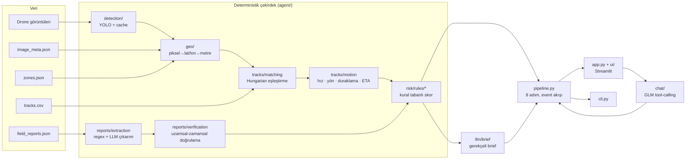

# Üs Koruma Agent'ı

**Level-Up AI · ROKETSAN Yapay Zekâ Hackathonu · Aşama 2**

Drone görüntülerindeki araçları tespit eden, bunları haritaya yerleştiren, son iki saatlik hareketlerini inceleyen
ve saha raporlarıyla karşılaştıran bir agent. Sonunda her araç için **"üs için risk var mı, neden?"**
sorusunu gerekçeli bir brief ile cevaplıyor.

| Doküman | Ne için |
|---|---|
| **README.md** | Proje ne, nasıl çalışır, nasıl kurulur. İlk okunacak dosya |
| [STEPS.md](STEPS.md) | **Tüm işler**: sıralı step'ler, bağımlılıkları, her step'in yazacağı ve etkileyeceği dosyalar |
| [STRUCTURE.md](STRUCTURE.md) | Klasör/dosya haritası |
| [CONTRIBUTING.md](CONTRIBUTING.md) | Git akışı, branch/commit/PR kuralları, conflict önleme |
| [OPEN_ISSUES.md](OPEN_ISSUES.md) | Henüz karar verilmemiş konular |
| [PROGRESS.md](PROGRESS.md) | Kim hangi step'te, ne bitti, hangi kararlar alındı |

---

## 1. Problem (case özeti)

**Aşama 1 · Kaggle (25–26 Eylül):** Drone görüntülerinde 200 px² ve üzeri araçları `car / van / truck / bus` olarak
tespit eden model. Metrik mAP@0.5, final sıralama Private Leaderboard'a göre. Bu modeli Aşama 2'de kullanıyoruz.

**Aşama 2 · Agent (26–27 Eylül):** Bir üssü korumak gerekiyor. Çevredeki 8 bölge gün boyu drone'larla izleniyor.

| Girdi | İçerik |
|---|---|
| 40 drone görüntüsü | 8 bölge, 1 gün, 960×540 |
| `image_meta.json` | Her görüntünün çekim saati ve 4 köşesinin lat/lon'u → piksel koordinata çevrilebilir |
| `zones.json` | Üssün konumu ve bölge merkezleri |
| `tracks.csv` | Araçların son 2 saatlik konumları, 5 dakikalık adımlarla |
| `field_reports.json` | Serbest metin saha raporları (`official` / `third_party`) |

**Çıktı:** Araçların üs için risk oluşturup oluşturmadığını açıklayan kısa, gerekçeli bir brief.

**Kritik noktalar:**
- Track'ler ve raporlar **tek havuz**. Hangi görüntüyle ilgili oldukları verilmiyor; bağlamı çekim saati ve köşe koordinatlarıyla biz kuruyoruz.
- **Raporların hepsi doğru değil.** Bazıları kasıtlı ya da yanlışlıkla hatalı, bazıları konu dışı. Agent önce kendi tespitine ve hareket verisine güvenmeli.
- LLM olarak `glm-5.3-flash` var (OpenAI-uyumlu, tool calling ve görüntü girdisi destekleniyor), bütçe 15 $. Ayrıntılar §8'de.

**Değerlendirme:** Final puan üç parçadan oluşuyor: Kaggle Private LB + **mentor** (kod kalitesi ve mimari) + **jüri**.
Jüri kriterleri: iş değeri, çalışan ürün, ürün/UX, sunum/demo. Demo'da agent'ın en az 1–2 görüntüde gerçekten çalıştığı gösterilmeli.

---

## 2. Yaklaşım ve tasarım ilkeleri

1. **Sayılar Python'dan, kelimeler LLM'den.** LLM mesafe ya da hız hesaplamaz, risk seviyesini değiştirmez; sadece anlatır.
2. **Raporlar iddiadır, kanıt değil.** Güven verici ama doğrulanmamış bir iddia skoru asla düşürmez.
3. **Her karar izlenebilir.** `VehicleFinding.factors` her puanın gerekçesini tutar. Jüriye "neden HIGH?" sorusunun cevabı bu tablodur.
4. **İki mod.** Sabit pipeline (güvenilir demo) ve tool-calling sohbet (agent yeteneği) aynı fonksiyonları kullanır.
5. **Modüller sadece şemalarla konuşur.** `agent/schemas/` sözleşmedir. Bir modülün içi değişse bile imzası aynı kaldıkça kimse etkilenmez.
6. **Yeni yetenek = yeni dosya.** Risk kuralı, sohbet tool'u ve UI sekmesi otomatik kaydolur. Mevcut dosyayı düzenlemek gerekmez, bu yüzden conflict de çıkmaz.
7. **Kırılmayan demo.** Pipeline'daki bir adım hata verirse diğerleri çalışmaya devam eder. Tespit ve LLM yanıtları cache'lenir. LLM erişilemezse brief şablondan üretilir.

---

## 3. Mimari



Ayrıntılı klasör haritası: [STRUCTURE.md](STRUCTURE.md).

---

## 4. Pipeline — 8 adım

Case'teki 4 aşamalı akış (01 Tespit · 02 Konumlandırma · 03 Hareket · 04 Risk) koda aşağıdaki gibi karşılık geliyor:

| # | Akış | Adım | Kod | Girdi → Çıktı | Step |
|---|---|---|---|---|---|
| 1 | — | Yükle | `loaders` | dosyalar → `ImageMeta`, `ZonesFile`, `TrackPoint`, `FieldReport` | hazır |
| 2 | 01 | Tespit | `detection/detector.py` | görüntü → `list[Detection]` | DET-2, DET-3 |
| 3 | 02 | Konumlandır | `geo/locate.py` | `Detection` → `GeoDetection` (lat/lon, üsse mesafe, bölge) | GEO-1, GEO-2 |
| 4 | 03 | Eşleştir | `tracks/matching.py` | `GeoDetection` + track'ler → `TrackMatch` | TRK-1 |
| 5 | 03 | Hareket | `tracks/motion.py` | track → `MotionProfile` (hız, yön, ETA) | TRK-2 |
| 6 | 04 | Rapor çıkar | `reports/extraction.py` (+ `llm_extraction.py`) | `FieldReport` → `ReportClaim` | RAP-2, LLM-3 |
| 7 | 04 | Doğrula | `reports/verification.py` | `ReportClaim` → `ClaimVerdict` | RAP-3 |
| 8 | 04 | Skor + brief | `risk/scoring.py` + `rules/*`, `llm/brief.py` | → `VehicleFinding` (factors), `Brief` | RSK-1..3, LLM-2 |

Orkestrasyon `pipeline.py` içinde (PIP-1, PIP-2). Her adım `PipelineEvent` üretir; arayüz ve sohbet akışı bu event'lerden izler.

---

## 5. Görevler

Tüm işler **[STEPS.md](STEPS.md)** içinde step'lere bölünmüş durumda. Kısaca:

- **Step 0 hazır:** şemalar, ayarlar, veri okuyucular, mesafe/zaman yardımcıları, risk motoru, tool kaydı, sahte veri, arayüz iskeleti.
- **11 hat, 35 step.** Her step ya bağımsız ya da sadece aynı hattaki bir önceki step'e bağlı. Hatlar paralel ilerler.
- Başka hattın kodu hazır değilse `agent/fakes.py` ile çalışılır; kimse kimseyi beklemez.
- Sadece en sondaki **SON** hattı (uçtan uca test → kalibrasyon → demo) diğer hatların bitmesini bekler.

| Hat | Step'ler | Önerilen kişi |
|---|---|---|
| DET · tespit | DET-1 … DET-4 | K1 |
| GEO · konum, VERI-1, TRK-1 | GEO-1, GEO-2, VERI-1, TRK-1 | K2 |
| TRK-2, RSK · hareket ve risk kuralları | TRK-2, RSK-1 … RSK-3 | K3 |
| RAP · raporlar, VERI-2 | RAP-1 … RAP-3, VERI-2 | K4 |
| LLM, PIP · dil katmanı, sohbet, orkestrasyon | LLM-1 … LLM-5, PIP-1, PIP-2 | K5 |
| UI, SUN · arayüz ve sunum | UI-1 … UI-5, SUN-1 … SUN-3 | K6 |
| SON · entegrasyon | SON-1 … SON-4 | K2, K3, K6 |

Kim hangi step'te ve durumu ne: [PROGRESS.md](PROGRESS.md).

---

## 6. Kurulum ve çalıştırma

```bash
git clone https://github.com/karaokteam/dss.git && cd dss
python -m venv .venv && source .venv/bin/activate      # Windows: .venv\Scripts\activate
pip install -r requirements.txt
cp .env.example .env                                   # GLM_API_KEY'i doldur (takıma iletilecek)
git config user.name "Ad Soyad (K<no>)"                # commit'lerde kimin yaptığı görünsün

# Model (git dışı; veri paketi zaten repoda: data/raw/)
cp best.pt models/                                     # Aşama 1 modeli (DET-1)

pytest -q                         # testler (yazılmamış step'lerin testleri "skipped")
python -m scripts.check_data      # veri varsayımlarını kontrol et (VERI-1)
streamlit run app.py              # demo arayüzü
python cli.py img_000860          # komut satırı (UI-5)
```

Commit öncesi: `ruff format . && ruff check . && pytest -q`

---

## 7. Birlikte çalışma (conflict'siz)

Ayrıntılar [CONTRIBUTING.md](CONTRIBUTING.md)'de. Özet:

1. **Sadece kendi step'inin "Yazılacak dosyalar"ına dokun.** Dosyaların neredeyse hepsinin tek sahibi var.
2. **Branch:** `step/<ID>-<kısa-ad>`, kısa ömürlü; `main`'e PR ile *squash merge*. `main` her an demo edilebilir kalmalı.
3. **Sık güncelle:** `git fetch && git rebase origin/main`, günde birkaç kez.
4. **Eşikler** `agent/config/<alan>.py` içinde, her step kendi bölümünde. Koda sayı gömülmez.
5. **Şema değişikliği:** yeni alan (varsayılan değerli) ya da yeni sınıf eklemek serbest. Mevcut bir alanı değiştirmek veya silmek önce ekibe sorulur.
6. **Yeni kural / tool / sekme** için yeni dosya açılır; mevcut dosyalar düzenlenmez.
7. **Kayıt:** karar gerekiyorsa `OPEN_ISSUES.md`, karar verilince `PROGRESS.md`. Her iki dosyada da herkes sadece kendi bölümüne yazar.
8. `ruff format` herkesin kodunu aynı biçime getirir, böylece biçim farkından conflict çıkmaz. `.gitattributes` satır sonlarını eşitler.

---

## 8. Veri paketi (geldi)

Paket repoda, `data/raw/` altında; `git pull` ile herkese geliyor. İçinde 40 görüntü, `image_meta.json`, `zones.json`,
`tracks.csv`, `field_reports.json` ve **[`gorev_tanimi.pdf`](data/raw/gorev_tanimi.pdf) (Aşama 2 görev tanımı + GLM API rehberi, mutlaka okuyun)** var.
Kod veriyi varsayılan olarak buradan okur, ek bir ayar gerekmez.

| Bilgi | Değer |
|---|---|
| Görüntü | 40 adet, kuzeye hizalı, 3 farklı boyutta (960×540 · 1360×765 · 1920×1080). Boyut her zaman `meta`'dan alınır |
| Track | 226 araç, her biri 25 nokta (2 saat, 5 dk adım). **Her track, ait olduğu görüntünün çekim anında biter** |
| Rapor | 137 adet (98 official, 39 third_party), 08:35–15:15. Konum koordinat ya da bölge adı olarak geçer |
| Bölge | 8 bölge + Merkez Üs (`zones.json`) |
| LLM | `glm-5.3-flash`, OpenAI-uyumlu gateway, 15 $, 60 istek/dk, aynı anda 4 istek. Anahtar ayrıca gelecek |

Görev tanımından önemli kurallar:
- Konum dönüşümü doğrusal orantıyla yapılır, formül PDF'te (GEO-1). Aracın konumu için kutunun merkezi kullanılır.
- Eşleştirmede `time == capture_time` olan track noktalarına bakılır. Birkaç metrelik sapma normaldir, en yakın nokta makul bir mesafe sınırı içinde seçilir (TRK-1).
- Park halindeki araçların kaydı olmayabilir; kaydı olan bir araç da çekim anında görüntü dışında kalmış olabilir.
- Hız ve yön tek adımdan değil, kaydın tamamından okunur (TRK-2).
- Rapor ile tespit çelişirse **tespit esas alınır**.

Kalan kontroller:
- [ ] `python -m scripts.check_data` yazılsın ve özet bulgu dosyasına geçsin (VERI-1)
- [ ] Rapor metinleri incelensin, `TYPE_WORDS` / `DE_ESCALATE` sözlükleri genişletilsin (VERI-2 → RAP-1)
- [ ] img_000860 uçtan uca: truck · T0122 · üsse ~1,6 km (SON-1)
- [ ] `risk` eşikleri `scan_all` dağılımıyla kalibre edilsin (SON-2)

---

## 9. Sık sorulanlar

**Benim modülüm başka bir modülün çıktısını kullanıyor ama o henüz yazılmadı?**
`from agent.fakes import make_geo, make_motion, fake_assessment ...` ile sahte girdi kullan. Şema aynı olduğu için gerçek kod gelince hiçbir şey değişmez.

**Veri paketi / model / API anahtarı henüz yok?**
STEPS.md'de 📦 / 🧠 / 🔑 işareti olmayan step'lerin hepsine şimdi başlanabilir. Testler `data/samples/` ve `agent/fakes.py` ile çalışır.

**Bir eşik değeri koymam gerekiyor, nereye?**
`agent/config/<alan>.py` içindeki kendi step bölümüne. Kodda `config.ISIM` diye okunur.

**Yeni bir risk kuralı eklemek istiyorum?**
`agent/risk/rules/` altında ilgili dosyaya (ya da yeni bir dosyaya) `@rule` ile bir fonksiyon yaz, `RiskFactor` ya da `None` döndürsün. Başka bir yere dokunmana gerek yok.

**Sohbete yeni bir yetenek eklemek istiyorum?**
`agent/chat/tools/` altına `@tool(...)` ile bir fonksiyon ekle; otomatik kaydolur.

**Şemaya bir alan eklemem gerekiyor?**
Varsayılan değerli yeni bir alan eklemek serbest: `agent/schemas/<alan>.py`, küçük bir PR, başlıkta `[SCHEMA]`. Mevcut bir alanı değiştirmek ya da silmek için önce OPEN_ISSUES'a yaz.

**Bir karar vermem gerekiyor ama emin değilim?**
Makul bir varsayılanla devam et. Varsayımını `OPEN_ISSUES.md`'de kendi alanının bölümüne yaz ve ekibe haber ver.

**Test kırmızı ama benim kodumdan değil?**
Kendi step'inin testi yeşilse PR'ını aç. Kırmızı testin sahibini (dosyanın başında step ID'si yazıyor) haberdar et.

**Demo sırasında internet ya da LLM giderse?**
Tespitler cache'ten gelir, brief şablondan üretilir (LLM-2), CLI yedeği var (UI-5). SON-3 bunu önceden test eder.
