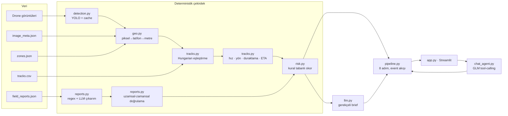

# Üs Koruma Agent'ı — Mimari Şablon (Level-Up AI · Aşama 2)

## Mimari



**Tasarım ilkeleri**
1. Sayılar Python'dan, kelimeler LLM'den. LLM mesafe/hız hesaplamaz, risk seviyesini değiştirmez.
2. Raporlar iddiadır, kanıt değil. Güven verici ama doğrulanmamış iddialar skoru asla düşürmez.
3. Her karar izlenebilir: `VehicleFinding.factors` her puanın gerekçesini tutar.
4. İki mod: sabit pipeline (güvenilir demo) + tool-calling sohbet (agent yeteneği).

## Klasör yapısı
```
agent/
  config.py      eşikler, yollar, GLM ayarları
  schemas.py     Pydantic sözleşmeler (ekip arayüzü)
  geo.py         konumlandırma + kuzey-hizalı kare kontrolü
  detection.py   1. gün modeli, JSON cache
  tracks.py      eşleştirme + hareket analizi
  reports.py     rapor çıkarımı + doğrulama
  risk.py        açıklanabilir skor
  llm.py         GLM istemcisi, brief promptu
  pipeline.py    8 adımlı akış, scan_all
  chat_agent.py  tool-calling döngüsü
app.py           Streamlit demo (değerlendir · durum tablosu · sohbet)
tests/           img_000860 referans testleri
data/  models/  cache/
```

## Çalıştırma
```bash
pip install -r requirements.txt
export GLM_API_KEY=... GLM_BASE_URL=... GLM_MODEL_FAST=... GLM_MODEL_SMART=...
cp best.pt models/ ; cp -r <veri paketi>/* data/
pytest -q
streamlit run app.py
```

## Ekip dağılımı (6 kişi)
| Kişi | Modül |
|---|---|
| 1 | detection.py — eşik ayarı, 40 görüntü cache |
| 2 | geo.py + tracks.py eşleştirme |
| 3 | tracks.py hareket + risk.py kuralları |
| 4 | reports.py — çıkarım ve doğrulama |
| 5 | llm.py + chat_agent.py — promptlar, tool'lar |
| 6 | app.py + sunum |

## Veri gelince ilk yapılacaklar
- [ ] `check_north_up` ile 40 görüntünün varsayımını doğrula
- [ ] Her track'in son zamanının bir görüntünün `capture_time`'ına eşit olup olmadığını kontrol et
- [ ] img_000860 üzerinde uçtan uca çalıştır: truck, T0122, ~1,6 km çıkmalı
- [ ] Rapor metinlerini gözden geçirip `TYPE_WORDS` / `DE_ESCALATE` sözlüklerini genişlet
- [ ] risk.py eşiklerini tüm görüntülerde kalibre et (scan_all dağılımına bak)
