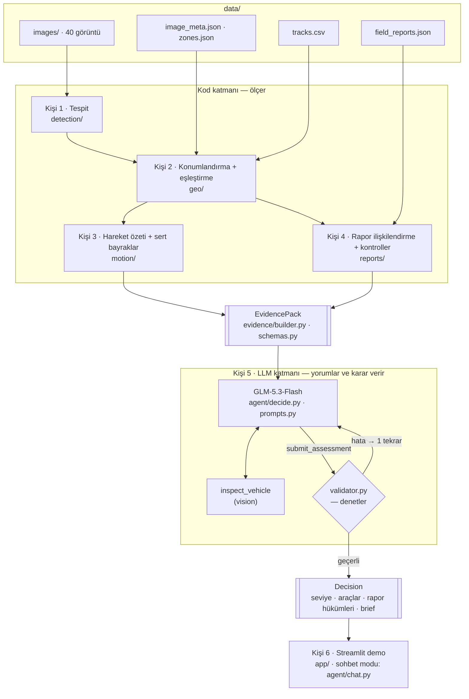

# DSS — Üs Koruma Karar Destek Sistemi

Level-Up AI | ROKETSAN Yapay Zekâ Hackathonu · Aşama 2

Drone görüntülerindeki araçları tespit eden, hareket kayıtları ve saha raporlarıyla birleştirip hangi durumların dikkat gerektirdiğine gerekçeli olarak karar veren bir LLM agent.

**İlke:** Kod ölçer, LLM yorumlar ve karar verir, kod denetler. Ayrıntılar: [`docs/ARCHITECTURE.md`](docs/ARCHITECTURE.md)

## Mimari



### Akış (görüntü başına)
1. **Tespit** — araçlar bulunur, kutu merkezleri lat/lon'a çevrilir.
2. **Eşleştirme** — çekim saatindeki track'lerle Hungarian eşleştirme; track'siz araç park halinde olabilir.
3. **Hareket** — 2 saatlik iz: hız, yön, duraklama, ETA; kural tabanı sert bayrakları ve `rule_floor`'u üretir.
4. **Raporlar** — kare merkezine ≤250 m ve çekimden önceki 120 dk içindeki raporlar seçilir; her biri için objektif kontroller hesaplanır.
5. **Kanıt paketi** — hepsi tek JSON'da (~3K token), kimliklerle: `D1`, `T0122`, `R001`, `F1`.
6. **Karar** — GLM her rapora hüküm verir, araçları ve genel seviyeyi belirler, `submit_assessment` ile teslim eder.
7. **Denetim** — validator: seviye `rule_floor` altında olamaz, her rapora hüküm, uydurma kimlik yok, doğrulanmamış dost iddiası riski düşüremez.

### Güven hiyerarşisi
Kendi tespitimiz > hareket kaydı > official rapor > third_party rapor. Raporlar kanıt değil iddiadır.

## Klasör yapısı

```
dss/                         ← repo kökü
├── README.md
├── requirements.txt
├── .env.example             ← .env'e kopyalayıp doldurun (pushlanmaz)
├── .gitignore
├── data/                    ← Aşama 2 verisi (pushlanır)
│   ├── image_meta.json
│   ├── zones.json
│   ├── tracks.csv
│   ├── field_reports.json
│   └── images/              ← 40 drone görüntüsü
├── models/                  ← best.pt buraya (pushlanmaz, Drive'dan indirin)
├── cache/                   ← tespit ve LLM cache'i (pushlanmaz)
├── dss/                     ← Python paketi
│   ├── schemas.py           ← ORTAK SÖZLEŞME: EvidencePack, Decision
│   ├── detection/detector.py        Kişi 1
│   ├── geo/geo.py, matching.py      Kişi 2
│   ├── motion/motion.py, flags.py   Kişi 3
│   ├── reports/association.py, checks.py   Kişi 4
│   ├── evidence/builder.py          ortak (paketi birleştirir)
│   └── agent/                       Kişi 5
│       ├── llm_client.py, prompts.py, decide.py, chat.py
│       ├── tools.py         ← tool şemaları
│       └── validator.py     ← karar denetimi
├── app/streamlit_app.py             Kişi 6
├── eval/                            Kişi 4 + 5
│   ├── gold_reports.json    ← elle etiketlenmiş rapor hükümleri
│   ├── run_eval.py
│   └── examples/            ← örnek EvidencePack ve Decision
├── tests/
├── notebooks/
└── docs/ARCHITECTURE.md
```

## İş bölümü

| Kişi | Alan | Modüller | Teslim ettiği | Bağımlı olduğu |
|---|---|---|---|---|
| **1** | Tespit | `dss/detection/` | 40 görüntünün tespitleri (`cache/det_*.json`), araç kırpma fonksiyonu | Kaggle modeli |
| **2** | Konumlandırma ve eşleştirme | `dss/geo/` | `pixel_to_latlon`, `to_local`, `nearest_zone`, Hungarian eşleştirme | Kişi 1 çıktı formatı |
| **3** | Hareket ve sert bayraklar | `dss/motion/` | `MotionEv` özetleri, `HardFlag` listesi, eşik kalibrasyonu | Kişi 2 (`load_tracks`, `to_local`) |
| **4** | Rapor ilişkilendirme ve kontroller | `dss/reports/`, `eval/gold_reports.json` | Görüntü başına rapor listesi, `ReportChecks`, 15-20 etiketli rapor | Kişi 2 |
| **5 · ** | LLM ve agent | `dss/agent/`, `dss/schemas.py` | Prompt'lar, karar döngüsü, validator, sohbet modu, `inspect_vehicle` | `EvidencePack` (herkes) |
| **6** | Arayüz, demo ve sunum | `app/`, sunum dosyası | Streamlit demo, harita, durum tablosu, jüri sunumu | `assess(image_id)` (Kişi 5) |

### Ortak kurallar
- **`dss/schemas.py` sözleşmedir.** Alan eklemek/değiştirmek için önce Kişi 5 ile konuşun.
- Herkes kendi modülünde çalışır; `evidence/builder.py` içindeki geçici fonksiyonlar, ilgili modül hazır oldukça onun çağrılarıyla değiştirilir.
- Her modül `tests/` altında en az bir test içerir. Referans vaka: `img_000860` → truck, `T0122`, üsse ~1,6 km.
- Push'tan önce `git pull --rebase`, ardından `pytest -q`.

### Zaman planı (26–27 Eylül)
| Zaman | Hedef |
|---|---|
| Cmt öğleden sonra | Arayüzler sabit; herkes mock veriyle kendi modülünde |
| Cmt akşam | Uçtan uca ilk çalışan akış (tek görüntü) |
| Cmt gece | 40 görüntü cache'lendi; eşikler ve prompt kalibre |
| Pazar sabah | Demo provası, sunum, yedek (cache) modu testi |

## Kurulum

```powershell
python -m venv .venv
.\.venv\Scripts\Activate.ps1
pip install -r requirements.txt
Copy-Item .env.example .env      # sonra .env'i doldurun
# best.pt'yi models/ klasörüne koyun
pytest -q
streamlit run app/streamlit_app.py
```

## Pushlanmayanlar
`.env` (API anahtarı), `models/` (ağırlıklar), `cache/`, Kaggle 1. aşama verisi, sanal ortam ve IDE dosyaları. Liste: `.gitignore`.
