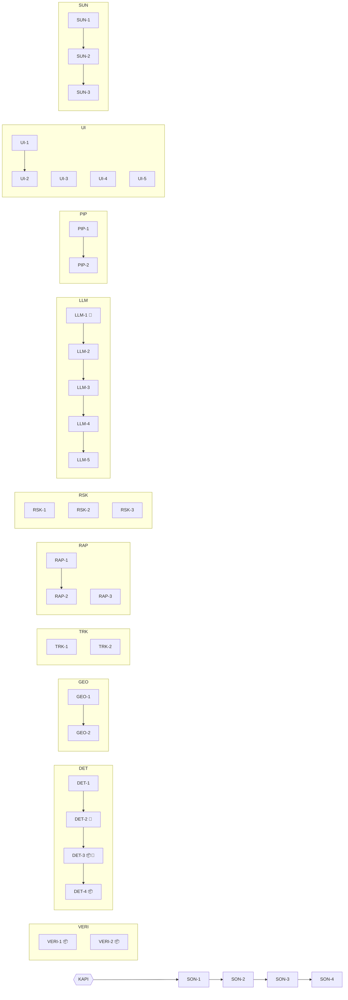

# Adımlar (Steps)

Projedeki **tüm işler** burada, kişiye göre değil **işe göre** bölünmüş halde.
Kişi önerisi en sonda (§4); iş bitiren sıradaki boş step'i alabilir.

## Kurallar

1. **Bağımlılık:** Her step ya **bağımsızdır** ya da **sadece aynı hattaki bir önceki step'e** bağlıdır.
   Hatlar birbirini beklemez. Tek istisna en sondaki **SON** hattı; o bilerek "kapı" arkasında (§3).
2. **Yazılacak dosyalar:** Step'in dokunabileceği dosyalar sadece bunlar. Neredeyse her dosyanın tek bir sahibi var.
   Üç istisna var: `config/tracks.py` (TRK-1, TRK-2), `config/risk.py` (RSK-1..3, SON-2) ve `pipeline.py` (PIP-1 → PIP-2).
   Bunlarda her step, dosyada kendi ID'siyle başlayan bölüme yazar. Bölümler boş satırla ayrıldığı için git bunları conflict'siz birleştirir.
3. **Etkilediği yerler:** Bu step bitince davranışı değişen veya gerçek veriyle çalışmaya başlayan yerler. **Onlara
   dokunulmaz**; sadece bilgi amaçlı ("benim işim bitince şunlar canlanır").
4. **Başka hattın kodu hazır değilse:** `agent/fakes.py` içindeki sahte nesnelerle (`make_geo`, `make_motion`,
   `fake_assessment`, `fake_events` …) geliştir ve test et. Hiçbir step başkasını beklemek zorunda değil.
5. Branch adı: `step/<ID>-<kısa-ad>` (ör. `step/GEO-1-projection`). Commit: `GEO-1: ...`
6. Step bitince: testi yeşil, PR merge edildi, [PROGRESS.md](PROGRESS.md)'de 🟩.

Simgeler: 📦 veri paketi gerekir (geldi: `data/raw/`) · 🔑 GLM API anahtarı gerekir · 🧠 `models/best.pt` gerekir.
Simgesi olmayan step **şimdi** başlayabilir.

---

## 0. Step 0 — Hazır altyapı ✅

Herkesin ortak kullandığı parçalar yazıldı ve test edildi. Hatlar arası bağımlılık bu sayede yok.
**Bunlar sadece ekip kararıyla değişir** ([CONTRIBUTING.md](CONTRIBUTING.md) §5).

| Parça | Dosya | Ne sağlar |
|---|---|---|
| Sözleşmeler | `agent/schemas/*.py` | Tüm modüllerin girdi/çıktı tipleri |
| Ayarlar | `agent/config/*.py` | Yollar + alan başına eşik dosyası |
| Veri okuma | `agent/loaders.py` | `load_image_meta/zones/tracks/reports`, `image_path` |
| Mekânsal | `agent/geo/spatial.py` | `distance_m`, `bearing_deg`, `nearest_zone` |
| Zaman serisi | `agent/tracks/timeline.py` | `series`, `positions_at` (enterpolasyon + tolerans) |
| Risk motoru | `agent/risk/scoring.py`, `registry.py` | `@rule` ile kayıt, puan toplama, seviye |
| Tool kaydı | `agent/chat/tools/registry.py` | `@tool` ile kayıt, `schemas()`, `dispatch()` |
| Sahte veri | `agent/fakes.py` | Tüm şemalar için hazır örnek + sahte pipeline akışı |
| Arayüz iskeleti | `app.py`, `ui/tab_*.py` | Sekmeler bağlı, içleri boş |
| Testler | `tests/test_foundation.py`, `test_risk_engine.py`, `test_chat_tools.py` | Yukarıdakilerin testleri |

---

## 1. Hatlar

### Özet tablo

| Step | İş | Bağımlı | Yazılacak dosyalar | Etkilediği yerler |
|---|---|---|---|---|
| VERI-1 📦 | Veri kontrol scripti | — | `scripts/check_data.py` | kararların tekrar doğrulanması |
| VERI-2 📦 | Rapor havuzu incelemesi | — | `exploration/…` | RAP-1 sözlüğü, OI-RAP-1 |
| DET-1 | Model teslimi | — | `kaggle/`, `models/best.pt` (git dışı) | DET-2 |
| DET-2 🧠 | Tespit sarmalayıcı | DET-1 | `agent/detection/detector.py`, `tests/test_detection.py` | pipeline adım 2 |
| DET-3 📦🧠 | Tespit cache'i | DET-2 | `agent/detection/cache.py`, `scripts/build_detection_cache.py` | demo hızı, SON-3 |
| DET-4 📦 | Güven eşiği kalibrasyonu | DET-3 | `agent/config/detection.py` | tüm bulgular |
| GEO-1 | Piksel → lat/lon | — | `agent/geo/projection.py`, `checks.py`, `tests/test_projection.py` | GEO-2, VERI-1 |
| GEO-2 | Tespitleri haritaya koy | GEO-1 | `agent/geo/locate.py`, `tests/test_locate.py` | pipeline adım 3 |
| TRK-1 | Tespit ↔ track eşleştirme | — | `agent/tracks/matching.py`, `tests/test_matching.py`, `config/tracks.py` (eşleştirme bölümü) | pipeline adım 4 |
| TRK-2 | Hareket analizi | — | `agent/tracks/motion.py`, `tests/test_motion.py`, `config/tracks.py` (hareket bölümü) | pipeline adım 5, RSK-2 |
| RAP-1 | Rapor sözlükleri | — | `agent/reports/lexicon.py` | RAP-2 |
| RAP-2 | Regex iddia çıkarımı | RAP-1 | `agent/reports/extraction.py`, `tests/test_extraction.py` | pipeline adım 6 |
| RAP-3 | İddia doğrulama | — | `agent/reports/verification.py`, `tests/test_verification.py` | pipeline adım 7, RSK-3 |
| RSK-1 | Konum kuralları | — | `agent/risk/rules/proximity.py`, `tests/test_rule_proximity.py` | skor |
| RSK-2 | Hareket kuralları | — | `agent/risk/rules/motion.py`, `tests/test_rule_motion.py` | skor |
| RSK-3 | Rapor kuralları | — | `agent/risk/rules/reports.py`, `tests/test_rule_reports.py` | skor |
| LLM-1 🔑 | GLM istemcisi | — | `agent/llm/client.py`, `agent/config/llm.py` | LLM-2..5 |
| LLM-2 | Gerekçeli brief | LLM-1 | `agent/llm/brief.py`, `prompts/brief_system.md`, `tests/test_brief.py` | pipeline adım 8 |
| LLM-3 | LLM ile rapor çıkarımı | LLM-2 | `agent/reports/llm_extraction.py`, `prompts/report_extraction.md` | pipeline adım 6 |
| LLM-4 | Sohbet tool'ları | LLM-3 | `agent/chat/tools/*.py` (registry hariç) | LLM-5 |
| LLM-5 | Sohbet döngüsü | LLM-4 | `agent/chat/agent.py`, `prompts/chat_system.md` | UI-4 |
| PIP-1 | 8 adımlı akış | — | `agent/pipeline.py` (`run_events`, `run`) | UI-2, LLM-4, SON-1 |
| PIP-2 | Toplu tarama | PIP-1 | `agent/pipeline.py` (`scan_all`), `scripts/scan_all.py` | UI-3, SON-2 |
| UI-1 | Harita bileşeni | — | `ui/map_view.py` | UI-2 |
| UI-2 | Değerlendir sekmesi | UI-1 | `ui/tab_evaluate.py` | demo |
| UI-3 | Durum tablosu sekmesi | — | `ui/tab_status.py` | demo |
| UI-4 | Sohbet sekmesi | — | `ui/tab_chat.py` | demo |
| UI-5 | CLI (demo yedeği) | — | `cli.py` | demo |
| SUN-1 | Sunum iskeleti | — | `docs/presentation/sunum.*` | jüri |
| SUN-2 | Demo senaryosu | SUN-1 | `docs/presentation/demo_senaryosu.md` | SON-4 |
| SUN-3 | Yedek materyal | SUN-2 | `docs/presentation/yedek/` | SON-4 |
| SON-1 | Uçtan uca referans testi | KAPI | `tests/test_reference_img_000860.py` | — |
| SON-2 | Risk kalibrasyonu | SON-1 | `agent/config/risk.py` | tüm seviyeler |
| SON-3 | Demo cache'i dondurma | SON-2 | `cache/` (+ karar: OI-SUN-1) | demo |
| SON-4 | Prova + `demo-final` etiketi | SON-3 | `PROGRESS.md` | teslim |

---

## 2. Step detayları

Her step'te: **Ne** · **Girdi → Çıktı** · **Bitti tanımı** · ilgili açık konu.

### VERI — veri doğrulama

**VERI-1 📦 · Veri kontrol scripti**
- Ne: Paketteki varsayımları sayılarla doğrulayan script. `loaders` hazır, doğrudan kullan. İlk elle kontrol yapıldı (PROGRESS → Kararlar); script bunu tekrarlanabilir hale getirir.
  1) dosyalar var mı, 40 görüntü mü; 2) `check_north_up` (GEO-1 hazır değilse köşe eşitliğini doğrudan kontrol et);
  3) her track'in son zamanı bir `capture_time`'a eşit mi; 4) rapor sayısı, kaynak dağılımı, saat aralığı;
  5) eşleştirme mesafe dağılımı (DET cache'i hazır olduğunda, OI-TRK-2 için).
- Çıktı: konsol özeti + `exploration/findings/<tarih>_veri-kontrol.md`
- Bitti: script tüm paket üzerinde hatasız çalışıyor; özet bulgu dosyasında.

**VERI-2 📦 · Rapor havuzu incelemesi**
- Ne: Tüm rapor metinlerini oku. Hangi kalıplar var (koordinat, bölge adı, adet, araç türü), hangileri yanıltıcı
  veya konu dışı? Sonuçları kategorilere ayır.
- Çıktı: `exploration/findings/<tarih>_rapor-havuzu.md`: kalıp listesi, `TYPE_WORDS`/`DE_ESCALATE` önerileri, şüpheli rapor örnekleri
- Bitti: RAP-1'e girdi olacak liste hazır; OI-RAP-1 için öneri yazıldı.

### DET — tespit (akış 01)

**DET-1 · Model teslimi**
- Ne: Aşama 1'deki en iyi ağırlığı `models/best.pt` olarak ekibe dağıt (git dışı; paylaşım yolu OI-DET-2).
  Final Kaggle notebook'u `kaggle/notebooks/` altına.
- Bitti: herkes `models/best.pt`'ye sahip; hangi submission'dan geldiği `kaggle/README.md`'de yazılı.

**DET-2 🧠 · Tespit sarmalayıcı** — bağımlı: DET-1
- Ne: `detect(image_id, use_cache)`. Ultralytics YOLO çağrısı, sınıf isimlerini `car/van/truck/bus`'a çevir,
  `DETECTION_CONF` altı ve `MIN_BOX_AREA_PX2` altı kutuları at. Kutu formatı: `x, y` sol-üst, `w, h`.
- Girdi → Çıktı: `image_id` → `list[Detection]`
- Bitti: `tests/test_detection.py` yeşil; img_000860'ta truck çıkıyor.

**DET-3 📦🧠 · Tespit cache'i** — bağımlı: DET-2
- Ne: `cache.read/write` (`cache/detections/<image_id>.json`); `detect()` önce cache'e bakar.
  `scripts/build_detection_cache.py` 40 görüntüyü tek seferde işler.
- Bitti: model olmadan da (`models/` boş) `detect()` cache'ten dönüyor.

**DET-4 📦 · Güven eşiği kalibrasyonu** — bağımlı: DET-3 · OI-DET-1
- Ne: Kaggle'da düşük confidence zarar vermiyordu ama burada yanlış tespit yanlış alarm demek. 5–10 görüntüye gözle bak, eşiği seç.
- Bitti: `config/detection.py` güncel, gerekçe `exploration/findings/`'ta.

### GEO — konumlandırma (akış 02)

**GEO-1 · Piksel → lat/lon**
- Ne: `pixel_to_latlon(px, py, meta)`. Formül görev tanımında veriliyor, 40 görüntünün hepsi kuzeye hizalı:
  `boylam = sol_üst.boylam + (x / genişlik) × (sağ_üst.boylam − sol_üst.boylam)`,
  `enlem = sol_üst.enlem + (y / yükseklik) × (sol_alt.enlem − sol_üst.enlem)`.
  Görüntü boyutları farklı olduğu için (960×540, 1360×765, 1920×1080) genişlik ve yükseklik her zaman `meta`'dan alınır.
  `check_north_up(meta)`: köşe eşitliği kontrolü.
- Bitti: `tests/test_projection.py`: img_000860 (756, 301) → ≈ (39.92531, 32.87183).

**GEO-2 · Tespitleri haritaya koy** — bağımlı: GEO-1
- Ne: `locate(detections, meta, zones)`: kutu merkezi → lat/lon, `spatial.distance_m` ile üsse mesafe, `spatial.nearest_zone`.
- Girdi → Çıktı: `list[Detection]` → `list[GeoDetection]` (aynı sıra)
- Bitti: `tests/test_locate.py` yeşil; img_000860 truck üsse ~1,6 km.

### TRK — hareket (akış 03)

**TRK-1 · Tespit ↔ track eşleştirme** · OI-TRK-2, OI-RSK-2
- Ne: `match(geo_dets, tracks, capture_time)`: `timeline.positions_at` ile çekim anındaki track konumları
  (her track ait olduğu görüntünün çekim anında biter, `time == capture_time`), mesafe matrisi,
  `scipy.optimize.linear_sum_assignment`, `MATCH_MAX_DIST_M` üstü → `track_id=None`. Park halindeki araçların kaydı olmayabilir;
  bu normal bir durum.
- Girdi → Çıktı: `list[GeoDetection]` → `list[TrackMatch]` (her tespit için bir tane)
- Bitti: `tests/test_matching.py` (fakes ile): doğru eşleşme, eşik üstü None, track sayısı < tespit sayısı durumu.

**TRK-2 · Hareket analizi** · OI-RSK-1
- Ne: `analyze(track_id, tracks, capture_time, zones)`: `timeline.series(until=capture_time)` (25 nokta, 2 saat).
  Araçlar döner, durur, üs çevresinde dolaşır; bu yüzden hız ve yön tek adımdan değil kaydın tamamından okunur. Ortalama/son hız,
  yön (`bearing_deg`), duraklama süresi (`STOP_SPEED_MPS`), son `APPROACH_WINDOW_MIN` dakikada üsse mesafe
  azalıyor mu, yaklaşma hızı, ETA = mesafe / yaklaşma hızı (kuş uçuşu), geçtiği bölgeler.
- Girdi → Çıktı: track noktaları → `MotionProfile`
- Bitti: `tests/test_motion.py`: yaklaşan, uzaklaşan (eta None), duran araç örnekleri.

### RAP — saha raporları (akış 04a)

**RAP-1 · Rapor sözlükleri**
- Ne: `lexicon.py` → `TYPE_WORDS`, `DE_ESCALATE`, `ESCALATE`. ASCII ve Türkçe karakterli yazımların ikisini de ekle.
  Veri gelmeden sunumdaki örneklerle başla; VERI-2 bulgusu gelince genişlet.
- Bitti: sözlükler VERI-2'deki kalıpları kapsıyor.

**RAP-2 · Regex iddia çıkarımı** — bağımlı: RAP-1
- Ne: `extract_regex(report)`: koordinat (`39.9374N 32.8483E`) **veya** bölge adı (`zones.json`'daki 8 bölge,
  ör. "Kuzeybati Yolu bolgesinde"), adet, sınıf, niyet. 137 rapor var; hava durumu gibi konu dışı olanlar `irrelevant`.
  `extract(reports, llm_fallback=None)`: regex'in çözemediği raporları `llm_fallback`'e verir (LLM-3 sonra takılır).
- Girdi → Çıktı: `list[FieldReport]` → `list[ReportClaim]`
- Bitti: `tests/test_extraction.py`: sunumdaki iki örnek rapor doğru ayrışıyor.

**RAP-3 · İddia doğrulama** · OI-RAP-1
- Ne: `verify(claims, geo_dets, meta, tracks)`: iddia zamanında, iddia konumunda (`positions_at` + `distance_m`) uygun
  sınıfta araç/track var mı? Varsa `confirmed`, açıkça zıt bir kanıt varsa `contradicted`, kanıt yoksa `unverifiable`,
  konu dışıysa `irrelevant`. `evidence` alanına okunabilir bir gerekçe yazılır.
- Kural: güven verici (`de_escalate`) iddia hiçbir zaman "tehdit yok" kanıtı sayılmaz.
- Bitti: `tests/test_verification.py` (fakes ile) yeşil.

### RSK — risk kuralları (akış 04b)

Her kural `RuleContext → RiskFactor | None` döndüren bir fonksiyon, `@rule` ile kaydolur. Kural dosyası
eklemek için motora dokunmak gerekmez. Yazılana kadar `None` döner, yani pipeline kırılmaz.

**RSK-1 · Konum kuralları**: üsse yakınlık, sınıf ağırlığı (truck/bus > car), kritik bölgede olmak.
**RSK-2 · Hareket kuralları**: yaklaşma + kısa ETA, uzun duraklama/dolaşma, eşleşmeyen araç (OI-RSK-2).
**RSK-3 · Rapor kuralları**: doğrulanmış tehdit iddiası puan ekler. `de_escalate`, `unverifiable` ve `contradicted`
iddialar **negatif puan üretmez**.
- Her biri için bitti: kendi test dosyası (fakes ile pozitif + negatif örnek) yeşil; eşikler `config/risk.py`'de ilgili bölümde.
- Not: RSK-1..3 `config/risk.py`'de kendi bölümlerine sabit ekler. Bölümler boş satırla ayrıldığı için conflict çıkmaz.

### LLM — dil katmanı ve sohbet

**LLM-1 🔑 · GLM istemcisi** · OI-LLM-2
- Ne: `chat(messages, effort, tools)`: `openai` SDK'sı `base_url` ile (bağlantı bilgileri `config/llm.py`'de hazır).
  Tek model var, `glm-5.3-flash`; hız/derinlik `reasoning_effort` ile ayarlanır. `max_tokens` cömert tutulur (düşünme de
  buna dahil), `thinking` parametresi gönderilmez, 429 alınırsa backoff yapılır, aynı anda en fazla 4 istek. Yanıtlar
  `cache/llm/` altında cache'lenir (aynı istek iki kez ücretlendirilmesin). Cevap `message.content`'te, düşünce `reasoning_content`'te.
- Bitti: tek satırlık bir test çağrısı çalışıyor; anahtar yoksa anlaşılır bir hata veriyor.

**LLM-2 · Gerekçeli brief** — bağımlı: LLM-1
- Ne: `template_brief(assessment)`: LLM'siz, deterministik metin. **Önce bunu yaz** (demo yedeği).
  `generate(assessment)`: factors ve sayılar prompta verilir, LLM sadece anlatır. Seviye `assessment`'tan kopyalanır.
  LLM hata verirse `template_brief` döner.
- Bitti: `tests/test_brief.py` yeşil; brief'teki her sayı factors'ta var.

**LLM-3 · LLM ile rapor çıkarımı** — bağımlı: LLM-2 (LLM-1 üzerinden)
- Ne: `extract_llm(report) → ReportClaim` (JSON çıktı, şemaya doğrulanır, cache'lenir). RAP-2'nin `extract`'ına
  `llm_fallback` olarak verilir. `extraction.py`'ye dokunulmaz.
- Bitti: regex'in çözemediği 3 örnek rapor doğru alanlara ayrışıyor.

**LLM-4 · Sohbet tool'ları** — bağımlı: LLM-3 (sıra için; kod olarak bağımsız)
- Ne: `chat/tools/assessment.py`, `data.py` gövdeleri: `assess_image`, `scan_all`, `list_images`, `get_track`, `find_reports`.
  Yeni tool için yeni dosya açıp `@tool` eklemek yeterli. Dönüş değeri JSON'a çevrilebilir ve kısa olmalı.
- Bitti: `tools.dispatch("list_images", {})` gerçek veriyle dönüyor.

**LLM-5 · Sohbet döngüsü** — bağımlı: LLM-4
- Ne: `reply(history, message)`: `client.chat(..., tools=tools.schemas())`, gelen tool_call'ları `tools.dispatch`
  ile çalıştır, en fazla `LLM_MAX_TOOL_TURNS` (10) tur. Sistem promptu: sayıları sadece tool çıktısından al, bulguyu gerekçelendir.
- Bitti: "img_000860'ta risk var mı, neden?" sorusuna tool çağırarak cevap veriyor.

### PIP — orkestrasyon

**PIP-1 · 8 adımlı akış**
- Ne: `run_events(image_id)`: README'deki 8 adımı sırayla çağırır, her adım için `start` ve `done`/`error` event'i üretir.
  Adımlar `try/except` içinde çalışır: bir adım çökerse ya da henüz yazılmadıysa (`NotImplementedError`)
  `error` event'i üretilir ve mümkünse devam edilir. `run()` son event'teki `assessment`'ı döndürür.
- Kod olarak bağımsız: sadece imzaları çağırır. Diğer hatlar bittikçe adımlar kendiliğinden çalışmaya başlar.
- Bitti: tüm adımlar yazıldığında img_000860 çalışıyor; yazılmayan adımlar demo'yu kırmıyor.

**PIP-2 · Toplu tarama** — bağımlı: PIP-1
- Ne: `scan_all(with_brief=False)` + `scripts/scan_all.py` (seviye dağılımı, en riskli 10 görüntü, factor histogramı).
- Bitti: 40 görüntü tek komutla taranıyor; SON-2 için çıktı hazır.

### UI — arayüz

Pipeline hazır değilse sekmeler `agent.fakes.fake_events` / `fake_assessment` ile geliştirilir.

**UI-1 · Harita bileşeni**: `render_map(zones, assessment, tracks)`: üs, bölgeler, görüntü karesi, tespitler, track izleri (pydeck).
**UI-2 · Değerlendir sekmesi** — bağımlı: UI-1: görüntü seç → adım adım event akışı → görüntü üstünde kutular + harita +
bulgu kartları (seviye, factors tablosu, rapor doğrulamaları) + brief.
**UI-3 · Durum tablosu**: `scan_all` sonucu, seviyeye göre sıralı, satıra tıklayınca detay.
**UI-4 · Sohbet sekmesi**: `st.chat_input` + `chat.agent.reply`; tool çağrılarını açılır panelde göster.
**UI-5 · CLI** (opsiyonel): `python cli.py img_000860` → adımlar + brief terminalde. İnternet/arayüz sorunu olursa demo yedeği.
- Her biri için bitti: sahte veriyle görünüyor; gerçek pipeline gelince değişiklik gerekmeden çalışıyor.

### SUN — sunum

**SUN-1 · Sunum iskeleti**: jüri kriterlerine göre akış (`docs/presentation/README.md`).
**SUN-2 · Demo senaryosu** — bağımlı: SUN-1: hangi 2–3 görüntü, hangi soru, hangi yanıltıcı rapor gösterilecek; kim ne söyleyecek.
**SUN-3 · Yedek materyal** — bağımlı: SUN-2: ekran görüntüleri, kısa ekran kaydı, çevrimdışı çalıştırma notu.

---

## 3. SON — entegrasyon hattı (kapılı)

**KAPI:** DET-3, GEO-2, TRK-1, TRK-2, RAP-2, RAP-3, RSK-1, RSK-2, RSK-3, LLM-2, PIP-2 bitti.
Bu hattın doğası gereği birden fazla hatta bağlı olan tek yer burası. Kapıdan sonra sırayla ilerler.

**SON-1 · Uçtan uca referans**: `tests/test_reference_img_000860.py`'deki skip satırını sil. Beklenen: truck · T0122 · ~1,6 km. Etiket `v0.5-e2e`.
**SON-2 · Risk kalibrasyonu** — bağımlı: SON-1: `scripts/scan_all.py` dağılımına bak, `config/risk.py` eşiklerini ayarla
(her şey CRITICAL ya da her şey LOW olmamalı). Karar ve gerekçe `PROGRESS.md`'ye yazılır. OI-RSK-1.
**SON-3 · Demo cache'i** — bağımlı: SON-2: demo görüntüleri için tespit ve LLM cache'lerini üret, internet olmadan da çalıştığını kontrol et. OI-SUN-1.
**SON-4 · Prova + teslim** — bağımlı: SON-3: SUN-2 senaryosuyla baştan sona prova, kod dondurma, `demo-final` etiketi.

---

## 4. Kişi önerisi (6 kişi)

Hatlar kabaca eşit yüke göre gruplandı. İşini bitiren, PROGRESS'te ⬜ olan herhangi bir step'i alabilir. Bunun için step'in yanına adını yazması yeterli.

| Kişi | Hatlar | Veri gelmeden başlayabileceği |
|---|---|---|
| K1 | DET-1 → DET-4 | DET-1, DET-2 (model varsa) |
| K2 | GEO-1 → GEO-2, VERI-1, TRK-1 · sonra SON-1 | GEO-1, GEO-2, TRK-1 |
| K3 | TRK-2, RSK-1, RSK-2, RSK-3 · sonra SON-2 | hepsi |
| K4 | RAP-1 → RAP-2, RAP-3, VERI-2 | RAP-1, RAP-2, RAP-3 |
| K5 | LLM-1 → LLM-5, PIP-1 → PIP-2 | PIP-1, PIP-2, LLM-4 |
| K6 | UI-1 → UI-5, SUN-1 → SUN-3 · sonra SON-3, SON-4 | hepsi |
