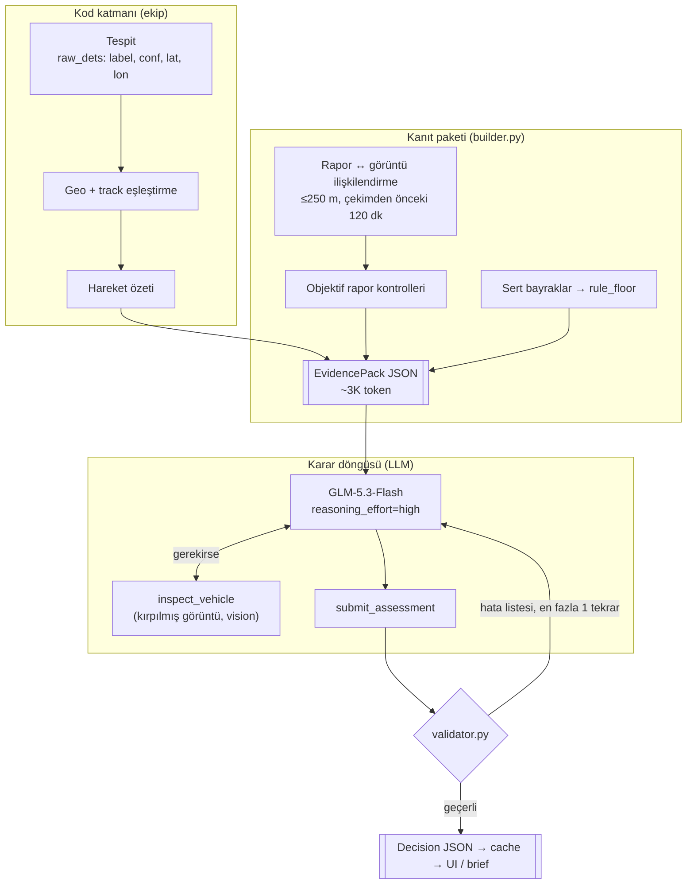
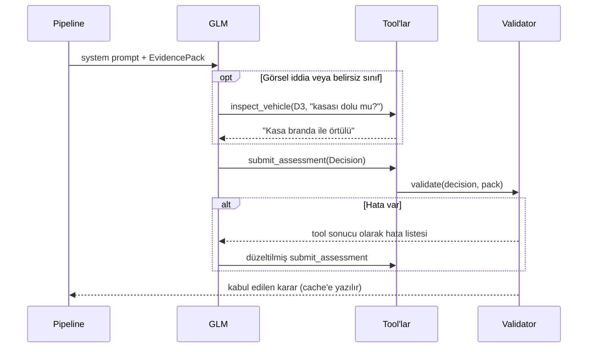

# LLM / Agent Katmanı — Mimari ve Veri Sözleşmeleri

## 1. Genel akış



**İlke:** Kod ölçer, LLM yorumlar ve karar verir, kod denetler.

## 2. Karar döngüsü (görüntü başına)



Döngü üst sınırı 6 adım. İkinci denemede de hata kalırsa karar `confidence="dusuk"` ile ve hatalar notlanarak kaydedilir; seviye en az `rule_floor` olur.

## 3. Dosyalar

| Dosya | Sorumluluk |
|---|---|
| `dss/schemas.py` | `EvidencePack` ve `Decision` sözleşmeleri, kimlik kuralları |
| `dss/evidence/builder.py` | Ham veri + tespitler → `EvidencePack` |
| `dss/agent/validator.py` | Karar denetimi: alt sınır, eksik hüküm, uydurma kimlik, dost-iddia politikası |
| `dss/agent/tools.py` | `submit_assessment`, `inspect_vehicle`, sohbet tool'ları ($ref'siz şema) |
| `eval/examples/example_evidence_pack.json` | img_003839 için gerçek veriden üretilmiş örnek paket |
| `eval/examples/example_decision.json` | Validator'dan geçen örnek karar |
| *(sıradaki)* `llm_client.py` | OpenAI SDK, semaphore(4), retry, cache, bütçe koruması |
| *(sıradaki)* `prompts.py` | System prompt: güven hiyerarşisi, kategori tanımları, örnek |
| *(sıradaki)* `decide.py` / `chat.py` | Karar döngüsü ve sohbet döngüsü |

## 4. Ekip arayüzü

Ekipten beklenen tek girdi, görüntü başına tespit listesi:

```python
raw_dets = [{"label": "truck", "conf": 0.91, "lat": 39.93742, "lon": 32.84829}, ...]
pack = build_pack(Data("data/"), "img_003839", raw_dets)
```

`builder.py` içindeki `Data.xy`, `motion` ve eşleştirme kısımları geçici. Geo/track modülü hazır olunca aynı imzayla onun fonksiyonları çağrılacak.

## 5. Kimlikler

| Önek | Anlamı | Örnek |
|---|---|---|
| `D` | Görüntüdeki tespit | `D3` |
| `T` | tracks.csv track_id | `T0182` |
| `R` | Rapor (field_reports.json sırası, 1'den) | `R001` |
| `F` | Kodun ürettiği sert bayrak | `F2` |

## 6. Politikalar (validator'da kodlu)

1. `attention_level` ≥ `rule_floor`. Daha yüksekse `deviation_from_rules` zorunlu.
2. `reports` listesindeki her rapora bir hüküm verilir; `context_reports` opsiyonel.
3. Karar yalnızca pakette var olan kimliklere atıf yapabilir.
4. `dost_kimlik` kategorisinde hüküm `DOGRULANDI` değilse `risk_effect` "azaltir" olamaz.
5. `DOGRULANDI` / `KISMEN_DOGRULANDI` / `CELISIYOR` hükümleri kanıt atfı olmadan verilemez.

## 7. Sert bayraklar (kalibre edilecek)

| Kod | Koşul | min_level |
|---|---|---|
| `YAKIN_VARIS` | ETA < 10 dk | KRITIK |
| `YAKIN_YAKLASMA` | Üsse < 1,5 km ve son 30 dk yaklaşma > 1 m/s | YUKSEK |
| `AGIR_ARAC_YAKIN` | truck/bus, üsse < 3 km | ORTA |
| `UZUN_BEKLEME_YAKIN` | Üsse 2 km içinde ≥ 30 dk duraklama | ORTA |
| `IZSIZ_AGIR_ARAC` | Track'i olmayan truck/bus, üsse < 3 km | ORTA |

## 8. Rapor kategorileri (`Decision.report_verdicts.category`)

`gorulme`, `hareketsizlik`, `hareket_yonu`, `dost_kimlik`, `bolge_olumsuz`, `olagan_yogunluk`, `gorsel_nitelik`, `gurultu`
