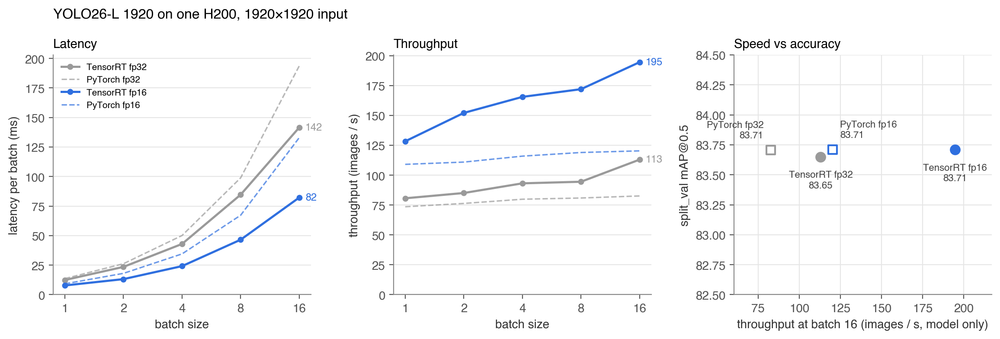

# Model serving: YOLO26-L on TensorRT

The phase 1 submission runs six detectors 22 times per image, which is fine for a leaderboard but too slow to
serve. For serving we picked one model, **YOLO26-L trained at 1920 px**: on its own it scores 83.71 mAP@0.5 on
split_val, close to the larger YOLO26-X (84.01) at about half the size. We converted it to TensorRT and measured
how fast it is and whether it loses accuracy.



| Backend | Precision | batch 1 | batch 2 | batch 4 | batch 8 | batch 16 | images/s at batch 16 | split_val mAP@0.5 |
|---|---|---|---|---|---|---|---|---|
| TensorRT | fp16 | 7.8 ms | 13.1 ms | 24.2 ms | 46.5 ms | 82.2 ms | **195** | 83.71 |
| TensorRT | fp32 | 12.4 ms | 23.5 ms | 42.9 ms | 84.7 ms | 141.6 ms | 113 | 83.65 |
| PyTorch | fp16 | 9.2 ms | 18.0 ms | 34.5 ms | 67.2 ms | 132.9 ms | 120 | 83.71 |
| PyTorch | fp32 | 13.6 ms | 26.2 ms | 50.1 ms | 98.9 ms | 193.7 ms | 83 | 83.71 |

What we found:

- **TensorRT fp16 is the one to serve.** It is 2.4x faster than plain PyTorch at batch 16 and loses no accuracy.
  Its engine is 58 MB (fp32: 109 MB).
- **Batching helps, but not linearly.** One image takes 7.8 ms; sixteen take 82 ms, so throughput goes from 128
  to 195 images per second.
- **int8 was not finished.** TensorRT 11 no longer calibrates int8 itself; Ultralytics does it with NVIDIA ModelOpt
  on the CPU, and at 1920 px it used more than 370 GB of RAM without finishing, so we stopped it.
- The times above are the model alone on 1920×1920 input on one NVIDIA H200. Reading the JPEG, resizing and NMS
  at the very low confidence threshold we used for mAP (0.005) bring it to about 35 images per second end to end;
  a normal serving threshold makes NMS much cheaper.

The accuracy is measured with the model trained on 70% of the images (its split twin), so split_val is unseen.
For serving, export the model trained on all images the same way.

## Files

```
export_engine.py   checkpoint -> TensorRT engine (fp32, fp16 or int8)
benchmark.py       latency and throughput for batch sizes 1-16
evaluate.py        split_val mAP@0.5 and end-to-end speed
plot.py            results/results.json -> plots and table
results/           our measurements
triton/            serving the engine with Triton Inference Server (below)
```

## How to run

This folder uses the paths and metric from `phase1_train` (same `work/` folder). Install
`requirements.txt` on top of `phase1_train/requirements/yolo.txt`.

```bash
python export_engine.py fp16                                    # -> work/engines/yolo26l_1920_split_fp16.engine
python benchmark.py tensorrt fp16 ../phase1_train/work/engines/yolo26l_1920_split_fp16.engine
python evaluate.py tensorrt fp16 ../phase1_train/work/engines/yolo26l_1920_split_fp16.engine
python benchmark.py pytorch fp16 ../phase1_train/work/weights/split/yolo26l_1920_split.pt
python plot.py
```

Building an fp16 engine takes about 15 minutes (most of it the ModelOpt conversion on the CPU). A TensorRT engine
only runs on the same GPU type and TensorRT version it was built with (here H200, TensorRT 11.3).

## Serving with Triton

`triton/` serves the fp16 engine with Triton Inference Server: a client sends one JPEG (like a frame from a drone
camera) and gets the boxes back. The server decodes the JPEG, fits it into 1920×1920, runs the engine and NMS
(confidence 0.25), and returns up to 300 boxes (x1, y1, x2, y2, score, class) in original image pixels. On a test image
its 67 boxes all match running the engine directly with Ultralytics (same box and class). Scores differ by up to
0.09 because the image is resized on the GPU instead of with OpenCV, so a box near the 0.25 cut-off can come or go:
the direct run had one more, a 0.32 bus on top of a truck.

It runs two copies of the model on the GPU with dynamic batching (Triton waits up to 2 ms to group waiting requests
into one batch of up to 16). In our load tests on one H200 this was the best setup: about 108 images/s with 32
clients, and one image on an idle server takes about 31 ms. Each copy needs about 40 GiB of GPU memory.

```
triton/model_repository/yolo26l/config.pbtxt   inputs, outputs, instances, batching
triton/model_repository/yolo26l/1/model.py     JPEG -> boxes
triton/start_server.sh                         starts tritonserver
triton/client.py                               sends one image and prints the boxes
```

How to run (Triton from the `nvidia-pytriton` wheel, no Docker needed):

```bash
cp ../phase1_train/work/engines/yolo26l_1920_split_fp16.engine triton/model_repository/yolo26l/1/model.engine
export TRITON_HOME=<site-packages>/pytriton/tritonserver   # tritonserver with the Python backend
export PYTHON_ENV=<venv with torch, torchvision, ultralytics>
export LIBPYTHON_DIR=<folder with libpython3.11.so>          # for a venv: the base Python's lib folder
export SITE_PACKAGES=<folder where tensorrt is installed>
bash triton/start_server.sh
python triton/client.py IMAGE
```

Two things we had to work around: the Python backend's NumPy bridge does not work with NumPy 2, so tensors go in
and out through DLPack, and the backend could not read string (BYTES) inputs, so the JPEG is sent as a uint8 array.
